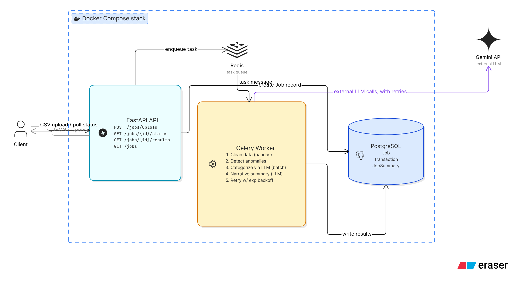

```markdown
# AI-Powered Transaction Processing Pipeline

Backend assignment for Alemeno — an async pipeline that ingests a CSV of raw transactions, cleans it, flags anomalies, uses an LLM to categorize transactions and generate a spending summary, and exposes everything via a polling REST API.

## Architecture

- **FastAPI** — REST API (upload, status, results)
- **PostgreSQL** (via SQLAlchemy + Alembic migrations) — stores jobs, transactions, and summaries
- **Redis + Celery** — async job queue and background worker
- **Google Gemini (gemini-2.5-flash)** — batched categorization + narrative summary, with structured JSON output, Pydantic validation, and retry/backoff (via `tenacity`)
- **Docker Compose** — single-command startup for all services



## Setup

**Requirements:** Docker and Docker Compose installed.

1. Clone the repo:
   ```bash
   https://github.com/devalshah-04/Alemeno-Co.-AI-Transaction-Processing-.git
   cd AI-Transaction-Processing-Pipeline
   ```

2. Create your `.env` file from the template, and add your own free Gemini API key (get one at https://aistudio.google.com/apikey):
   ```bash
   cp .env.example .env
   # then edit .env and set GEMINI_API_KEY=your_key_here
   ```

3. Start everything with a single command:
   ```bash
   docker compose up --build
   ```

   This starts PostgreSQL, Redis, the FastAPI API, and the Celery worker. Database tables are created automatically via Alembic migrations on startup.

4. The API is available at `http://localhost:8000`. Interactive API docs (Swagger UI): `http://localhost:8000/docs`.

## The processing pipeline

When a CSV is uploaded, the background worker runs these steps in order:

- **a) Data cleaning** — normalizes mixed date formats (`DD-MM-YYYY` and `YYYY/MM/DD`) to ISO 8601, strips `$` prefixes from amounts, uppercases currency and status values, fills missing categories with `Uncategorised`, and removes exact duplicate rows.
- **b) Anomaly detection** — flags transactions where the amount exceeds 3x the median amount for that account, and flags USD transactions on merchants that are normally domestic-only (Swiggy, Ola, IRCTC).
- **c) LLM categorization** — all transactions still marked `Uncategorised` are sent to Gemini in a **single batched request**. The response is validated against the 8 allowed categories using Pydantic; any missing or invalid assignment falls back to `Other` without discarding the rest of the batch.
- **d) Narrative summary** — total spend (by currency) and top 3 merchants are computed deterministically in pandas, then Gemini is asked (in one call, structured JSON output) for a short narrative and an overall risk level (`low`/`medium`/`high`).
- **e) Retry logic** — both Gemini calls (steps c and d) are wrapped with up to 3 attempts and exponential backoff (1s → 2s → 4s). If all retries fail, that step degrades gracefully (`llm_failed=true`, category `Other`, or a fallback narrative) instead of failing the entire job.

## API Endpoints

### Upload a CSV
```bash
curl -X POST http://localhost:8000/jobs/upload -F "file=@transactions.csv"
```
Response:
```json
{"job_id": 1, "status": "pending", "filename": "transactions.csv"}
```

### Check job status
```bash
curl http://localhost:8000/jobs/1/status
```
Returns `pending` / `processing` / `completed` / `failed`, row counts, and (once completed) the summary.

### Get full results
```bash
curl http://localhost:8000/jobs/1/results
```
Returns the full list of cleaned transactions (with anomaly flags and LLM-assigned categories) plus the AI-generated summary (totals by currency, top merchants, anomaly count, narrative, risk level).

### List all jobs
```bash
curl http://localhost:8000/jobs
curl "http://localhost:8000/jobs?status=completed"
```

## Database schema

- **jobs** — one row per uploaded file: filename, status, row counts (raw/clean), timestamps, error message
- **transactions** — one row per cleaned transaction: cleaned fields, anomaly flag + reason, LLM-assigned category, `llm_failed` flag
- **job_summaries** — one row per job: total spend by currency, top 3 merchants, anomaly count, narrative, risk level

Schema is version-controlled via Alembic migrations in `app/alembic/versions/`.

## Key design decisions

- **Median, not mean**, is used for the anomaly threshold — the mean would itself be skewed upward by the outliers being detected, undermining the check.
- **LLM output is never trusted directly.** Gemini's `response_mime_type: "application/json"` enforces the response shape, and a Pydantic model further validates that each returned category is one of the 8 allowed values — checked individually, so one invalid value doesn't discard the entire batch.
- **Totals and rankings are computed in pandas, not by the LLM** — the LLM is used only for the narrative text and risk judgment, where natural-language generation is actually needed. This also means the summary's numeric fields stay correct even if the LLM call fails entirely.
- **Partial failure is a first-class outcome.** A failed LLM call (after retries) doesn't fail the whole job — it's recorded via `llm_failed=true`, and the job still completes with the rest of the report intact.

## Tech stack

Python, FastAPI, SQLAlchemy, Alembic, PostgreSQL, Celery, Redis, pandas, Google Gemini API (`google-generativeai`), Pydantic, tenacity, Docker / Docker Compose.