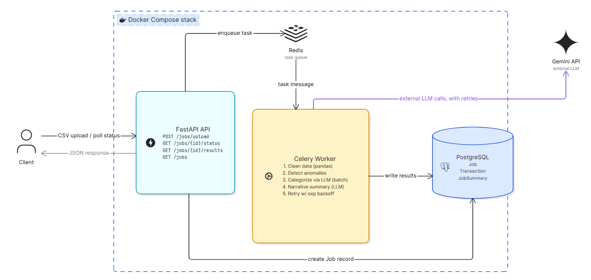

# AI-Powered Transaction Processing Pipeline

An async backend pipeline that ingests a CSV of raw, messy financial transactions and turns it into a cleaned dataset, a set of flagged anomalies, AI-assigned categories, and an AI-generated spending report — all retrievable through a small REST API, with the entire stack starting via a single `docker compose up`.

Built for the Alemeno Backend + DevOps Intern assignment.

## Video Walkthrough (3 min, system design + scaling discussion)

https://github.com/user-attachments/assets/db417f4b-c4bf-49ef-8d41-e9de66a2159d

## Architecture Diagram



---

## Table of Contents

- [Overview](#overview)
- [Quick Start](#quick-start)
- [Architecture](#architecture)
- [Project Structure](#project-structure)
- [The Processing Pipeline](#the-processing-pipeline)
- [API Reference](#api-reference)
- [Database Schema](#database-schema)
- [Engineering Highlights](#engineering-highlights)
- [Key Design Decisions](#key-design-decisions)
- [Scaling Considerations](#scaling-considerations)
- [Running Tests](#running-tests)
- [Tech Stack](#tech-stack)

---

## Overview

You upload a CSV of transactions; the API immediately hands it off to a background worker and returns a `job_id`. The worker then:

1. **Cleans** the data — fixes mixed date formats, currency symbols, inconsistent casing, missing categories, and duplicates
2. **Flags anomalies** — statistically unusual amounts and currency/merchant mismatches
3. **Categorizes** uncategorized transactions using Gemini, in a single batched call, with validated output
4. **Generates a narrative summary** — totals, top merchants, and an AI-written risk assessment
5. **Handles failure gracefully** — every LLM call is retried with exponential backoff, and a failed batch degrades the job instead of crashing it

You poll `/jobs/{job_id}/status` until it's `completed`, then fetch the full report from `/jobs/{job_id}/results`.

## Quick Start

**Requirements:** Docker and Docker Compose.

```bash
# 1. Clone the repo
git clone https://github.com/devalshah-04/Alemeno-Co.-AI-Transaction-Processing-.git
cd AI-Transaction-Processing-Pipeline

# 2. Set up your Gemini API key (free tier - https://aistudio.google.com/apikey)
cp .env.example .env
# then edit .env and set GEMINI_API_KEY=your_key_here

# 3. Start everything
docker compose up --build
```

That single command starts PostgreSQL, Redis, the FastAPI API, the Celery worker, and the Flower monitoring dashboard. Database tables are created automatically via Alembic migrations on startup — no manual setup steps.

| Service | URL |
|---|---|
| API | http://localhost:8000 |
| Interactive API docs (Swagger) | http://localhost:8000/docs |
| Flower (queue/worker monitoring) | http://localhost:5555 |

## Architecture

| Component | Role |
|---|---|
| **FastAPI** | REST API — accepts uploads, reports job status, serves results |
| **PostgreSQL** (SQLAlchemy + Alembic) | Stores `jobs`, `transactions`, and `job_summaries`; schema is version-controlled via migrations |
| **Redis** | Message broker and result backend for Celery |
| **Celery worker** | Runs the 5-step processing pipeline in the background |
| **Gemini 2.5 Flash** | Batched categorization + narrative summary, with structured JSON output and retry/backoff |
| **Flower** | Live dashboard for monitoring the task queue and worker |
| **Docker Compose** | Orchestrates all of the above with one command |

```
Client → FastAPI API → Redis (queue) → Celery worker → PostgreSQL
                ↑                            │
                └──── create Job record ─────┘
                                              │
                                   Gemini API (steps c & d,
                                   retried with backoff)
```

## Project Structure

```
AI-Transaction-Processing-Pipeline/
├── docker-compose.yml
├── architecture.png
├── README.md
├── .env.example
├── .github/
│   └── workflows/
│       └── ci.yml
└── app/
    ├── Dockerfile
    ├── requirements.txt
    ├── main.py                  # FastAPI app and endpoints
    ├── celery_app.py            # Celery configuration
    ├── tasks.py                 # process_job - orchestrates the pipeline
    ├── database.py              # SQLAlchemy engine/session setup
    ├── models.py                # Job, Transaction, JobSummary models
    ├── schemas.py                # Pydantic request/response schemas
    ├── logging_config.py        # Structured JSON logging setup
    ├── alembic.ini
    ├── alembic/
    │   ├── env.py
    │   └── versions/             # Migration history
    ├── pipeline/
    │   ├── cleaning.py           # Step a: data cleaning
    │   ├── anomalies.py          # Step b: anomaly detection
    │   ├── categorization.py     # Step c: LLM categorization (batched)
    │   ├── narrative.py          # Step d: LLM narrative summary
    │   └── llm_utils.py          # Step e: shared retry-wrapped Gemini call
    └── tests/
        ├── test_cleaning.py
        └── test_anomalies.py
```

## The Processing Pipeline

When a job is dequeued, the worker runs these steps **in order**:

**a) Data cleaning** — Dates in `DD-MM-YYYY` and `YYYY/MM/DD` are both normalized to ISO 8601 based on their structure (not guessed). `$` prefixes are stripped from amounts and converted to floats. Currency and status values are uppercased. Missing categories become `Uncategorised`. Exact duplicate rows are removed — checked *after* normalization, so rows that only differed by casing are correctly caught.

**b) Anomaly detection** — Two rules: (1) a transaction is flagged if its amount exceeds **3x the median** amount for its account — median rather than mean, because the mean would itself be dragged upward by the outliers being detected; (2) a transaction is flagged if it's in USD but the merchant is one that's normally domestic-only (Swiggy, Ola, IRCTC). Each flagged row stores *why* it was flagged (`anomaly_reason`), not just a boolean — explainable, not just detected.

**c) LLM categorization** — Every transaction still marked `Uncategorised` is sent to Gemini in a **single batched request** (not one call per row), identified by row index rather than `txn_id` (since some `txn_id` values are blank). Gemini's structured JSON output mode constrains the response shape; a Pydantic model with a `Literal` type then validates each returned category individually against the 8 allowed values. Any missing or invalid assignment falls back to `Other` — without discarding the rest of the batch.

**d) Narrative summary** — Total spend by currency, top 3 merchants, and anomaly count are computed deterministically in pandas (not by the LLM — arithmetic should be exact). Gemini is then asked, in one structured call, for a 2-3 sentence narrative and a `low`/`medium`/`high` risk level.

**e) Retry logic** — Both Gemini calls (steps c and d) share a single retry-wrapped helper (`tenacity`): up to 3 attempts with exponential backoff (1s → 2s → 4s). If all retries fail, that step degrades gracefully — `llm_failed=true`, category `Other`, or a fallback narrative — and the **job still completes**. A flaky LLM call never fails the whole job.

## API Reference

### `POST /jobs/upload`

Upload a CSV. Returns immediately with a `job_id`.

```bash
curl -X POST http://localhost:8000/jobs/upload -F "file=@transactions.csv"
```
```json
{"job_id": 1, "status": "pending", "filename": "transactions.csv"}
```

Uploading the **same file content** twice returns the existing job instead of creating a duplicate (see [Engineering Highlights](#engineering-highlights)).

### `GET /jobs/{job_id}/status`

```bash
curl http://localhost:8000/jobs/1/status
```

Returns `pending` / `processing` / `completed` / `failed`, row counts, and (once completed) the summary.

### `GET /jobs/{job_id}/results`

```bash
curl http://localhost:8000/jobs/1/results
```

Returns the full list of cleaned transactions (with anomaly flags and LLM-assigned categories) plus the AI-generated summary.

### `GET /jobs`

```bash
curl http://localhost:8000/jobs
curl "http://localhost:8000/jobs?status=completed"
```

List all jobs, optionally filtered by status.

### `GET /health`

```bash
curl http://localhost:8000/health
```

Confirms the API is running and can reach PostgreSQL — used for container health checks.

## Database Schema

- **jobs** — one row per uploaded file: filename, content hash (for idempotency), status, row counts (raw/clean), timestamps, error message
- **transactions** — one row per cleaned transaction: cleaned fields, anomaly flag + reason, LLM-assigned category, `llm_failed` flag
- **job_summaries** — one row per job: total spend by currency, top 3 merchants, anomaly count, narrative, risk level

Schema is fully version-controlled via Alembic migrations in `app/alembic/versions/` — no `create_all()` magic.

## Engineering Highlights

Beyond the core assignment requirements, this project includes:

- **Idempotent uploads** — the uploaded file's content is hashed (SHA-256); re-uploading identical content returns the original job rather than reprocessing it
- **Structured JSON logging** — every pipeline step emits structured log events (`job_id`, `step`, `row_count`, `duration`), making logs machine-parseable
- **Health check endpoint** — `/health` verifies database connectivity, suitable for container orchestration health checks
- **Flower dashboard** — live view of the Celery queue, active tasks, and task history at `http://localhost:5555`
- **Automated tests** — pure-function unit tests for the cleaning and anomaly-detection logic, run with `pytest`, using realistic edge cases from the actual dataset
- **CI pipeline** — GitHub Actions runs the test suite on every push

## Key Design Decisions

- **Median, not mean**, for the anomaly threshold — the mean would itself be skewed upward by the outliers being detected, undermining the check.
- **LLM output is never trusted directly.** Gemini's `response_mime_type: "application/json"` enforces the response shape; a Pydantic model further validates that each returned category is one of the 8 allowed values, checked individually so one bad value doesn't discard an entire batch.
- **Totals and rankings are computed in pandas, not by the LLM** — the LLM is used only for narrative text and risk judgment, where language generation is actually needed. The summary's numeric fields stay correct even if the LLM call fails entirely.
- **Partial failure is a first-class outcome.** A failed LLM call (after retries) doesn't fail the whole job — it's recorded via `llm_failed=true`, and the job still completes with the rest of the report intact.
- **Row index, not `txn_id`, identifies transactions to the LLM** — some `txn_id` values are blank in the source data; row index is always unique and present.

## Scaling Considerations

**Where this breaks at 100x traffic:**

- **Database connection pooling** — both the API and worker open connections per request/task; the default pool exhausts quickly under concurrent load.
- **Redis as a single point of failure** — it currently serves as both the Celery broker and result backend; if it goes down, both job dispatch and status tracking stop.
- **Gemini's rate limit becomes the hard ceiling** — regardless of how many Celery workers run, they share one API key and quota, so throughput is bounded by the LLM provider, not by compute.

**Next iteration for production scale:**

- Add **PgBouncer** for connection pooling, and split Redis into separate broker/result-backend instances (or move to a more durable broker like SQS for replay-ability).
- Introduce an **LLM gateway layer** — a thin service handling rate limiting, caching repeated merchant→category lookups, and fallback across multiple API keys/providers.
- **Separate Celery queues** — one for fast CPU-bound work (cleaning, anomaly detection) and one for LLM-bound work, so a slow LLM batch doesn't block cleaning jobs queued behind it.

The trade-off across all three: more operational complexity and moving pieces to monitor, in exchange for resilience and not being bottlenecked by a single external dependency.

## Running Tests

```bash
docker compose exec api pytest
```

Tests cover the pure-function pipeline logic (`cleaning.py`, `anomalies.py`) using edge cases drawn from the actual assignment dataset — mixed date formats, `$`-prefixed amounts, inconsistent casing, and the known anomaly cases.

## Tech Stack

Python · FastAPI · SQLAlchemy · Alembic · PostgreSQL · Celery · Redis · Flower · pandas · Google Gemini API (`google-generativeai`) · Pydantic · tenacity · pytest · Docker / Docker Compose · GitHub Actions
